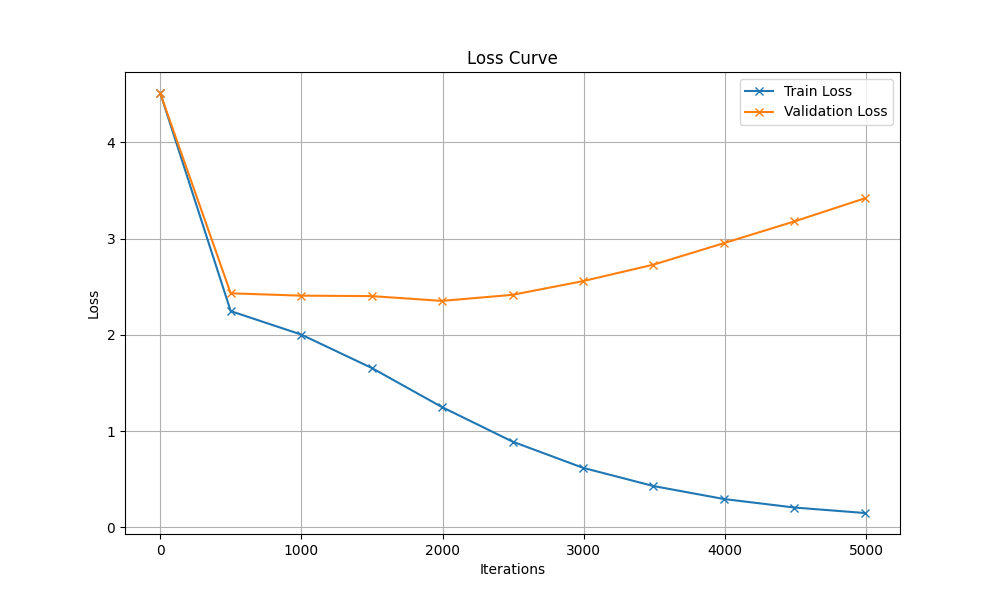

# Generated Song

## Hyperparameters

| Hyperparameter | Value |
|----------------|-------|
| name | modified_hyperparameters_1 |
| batch_size | 64 |
| block_size | 256 |
| max_iters | 5000 |
| eval_interval | 500 |
| learning_rate | 0.0001 |
| eval_iters | 200 |
| n_embd | 256 |
| n_head | 4 |
| n_layer | 4 |
| dropout | 0.3 |
| device | mps |

## Description

Uses original set of hyperparameter of 3rd notebook for training with a GPU with following modifications:

- reduce learning rate even further (0.0003 --> 0.0001)
- reduce size of embeddings a little bit (384 --> 256)
- increase dropout (0.2 --> 0.3)
- reduce attention heads and hidden layer (6 --> 4)

## Loss Curve



## Generated Song

```
unmbenl den Rädelbchfer,
schönels Heln im hol nin Tät.
4.
Gehrter nur volle Habe
ein Täumpferzu,
auptler ntetzte San,
alle seht,
wes ich grünen liebch.
Das kamt die Malef, juss Ja, wieder wir da!
3.
Schneefligen Was hägerkeinn,
die wein will fraumeißigen den Sche Bäumern
und Bauch ser weing flen
und sie mallein.
2.
Schen, die Bunder schlen, singen,
simm nuScher saß, euch reu’ und Kuckommsal,
das bald
alls ichin bar st him Traum’.
Schlund schaf, schlumm, summ, suns rumch herum!
2.
Sum, sollau´en such in spfen wir.
Das Af den Hälleind.
Schle hner demmen
Kuch, dem flem Strach,
ein Hüpfenn, durch.
Summ, summ, herum!

Am Bit summ!
Bunchen selel, wir deiebcher
s solle ges Chonisind,
wir du wir alle Hart,
Frühlichlig einken arst,
Summeld s, summ, summ!
Bienchopp, hopp!
Pferdck kuch und über, Vap, Jald wird ick mußer,
auf er Mänter st diebedetter gen.
3.
Das Mändch, Wind der mass Waler sehn,
das Was wirde flein
iederne Malern uf eine siellein.
2.
Das ganze Auf denbabe brüby brau3.
Das Morgan, 
