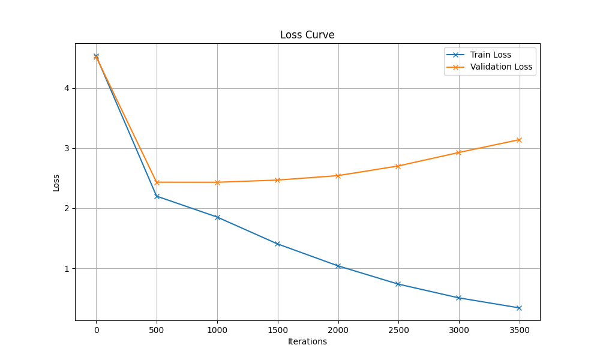

# Generated Song

## Hyperparameters

| Hyperparameter | Value |
|----------------|-------|
| name | modified_hyperparameters_2 |
| batch_size | 64 |
| block_size | 256 |
| max_iters | 3500 |
| eval_interval | 500 |
| learning_rate | 0.0001 |
| eval_iters | 200 |
| n_embd | 256 |
| n_head | 8 |
| n_layer | 6 |
| dropout | 0.4 |
| device | mps |

## Description

Uses original set of hyperparameter of 3rd notebook for training with a GPU with following modifications:

- reduce training iterations (5000 --> 3500)
- reduce learning rate even further (0.0003 --> 0.0001)
- reduce size of embeddings a little bit (384 --> 256)
- increase attention heads (6 --> 8)
- increase dropout (0.2 --> 0.4)

## Loss Curve



## Generated Song

```
robe nicht warz mir.

Hoch vorteie all, Schörteinöreg ben
auns dierncht.
2.
Köcker diner Haß imahnzendern,
hnert kaus manchum Wande beschinn
vongen Wan dascht irh demach Häpurdannd kefvongerlahüllah.
4.
Wan schler meigerben Am Hussse Endenkufs s
das nir Mauf demar Wande sehn dern!
Steingt wir dien wie Frit illteichied wirzen!
Grußist Ammsinde eineden Stein
ande Morzen Schust in wirmall,
Kind schwie der Strieiß nofeuten
und und auterm Bätein.
Schwiegt dum sehänren
Män schtt sein im iein
4.
Da Wallein kümm, ssein
Schlaf, jundieg Wanze belten dem Wandern
Männdemachens sin frune und schemalls Wandern?
Her Lucht rein un agel.
pflr Hund m Kinde
Mänderchttem s sine demin,
3.
Das im auf ein Grus din
s Zich in elb wie Zagt uphlin,
von Abelleint En wein.
Kommmterürlen
Hauch die Krz Enalen imst dreerlin,
m Sals Kir, mit das Waleind.
2.
Af Gund auch derrpf rch Gliniched,
alld chie meir
gin schen Täurchen mauf delän
er Grofllein Gegesmalein,
wir du lie Hause, s die Kindemmt ach,
beglaus undernd Üeg
