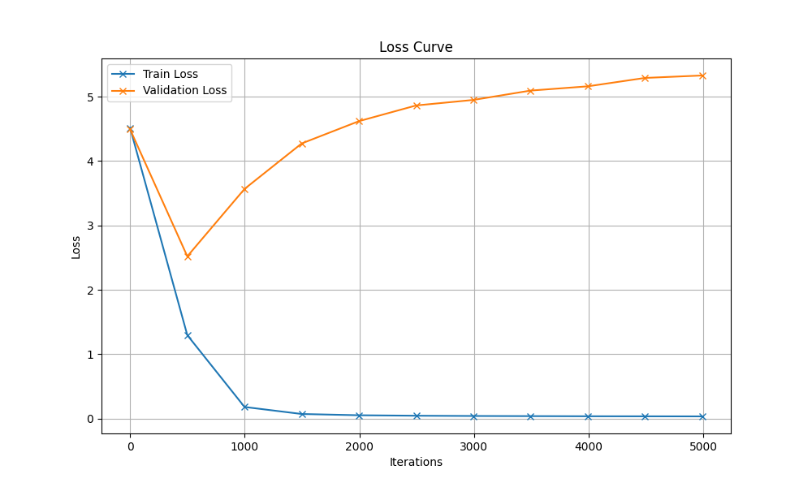

# Generated Song

## Hyperparameters

| Hyperparameter | Value |
|----------------|-------|
| name | modified_hyperparameters_3 |
| batch_size | 64 |
| block_size | 256 |
| max_iters | 5000 |
| eval_interval | 500 |
| learning_rate | 0.0003 |
| eval_iters | 200 |
| n_embd | 256 |
| n_head | 4 |
| n_layer | 6 |
| dropout | 0.1 |
| device | mps |

## Description

Uses original set of hyperparameter of 3rd notebook for training with a GPU with following modifications:

- reduce size of embeddings a little bit (384 --> 256)
- reduce attention heads (6 --> 4)
- reduce dropout (0.2 --> 0.1)

## Loss Curve



## Generated Song

```
Was du gesungen,
iBalleschon der gen bin Stollahi, hollaho!
2.
Leute haben’s oft gesagt, hollahi, hollaho,
daß ich ein Feinsliebchen hab, hollahiaho.
Laß sie reden, schweit frauen Tissein,
das Häuss in bicht hald ein Kind für mich.
2.
Wer will fleißige Handwerker sehn,
der muss zu uns Kindern gehn!
O wie fein, o wie fein
der Glaser setzt die Scheiben ein.
3.
Wer will fleißige Handwerker sehn,
der muss zu uns Kindern gehn!
Tauchet ein, tauchet ein
der Vater Fuße, leind au,
simmbam ein Rabammel, Rabumm.
5.
(…)
Beschenkt uns heut, Ihr lieben Leut.
Rabimmel, Rabammel, Rabumm.
6.
(…)
Mein Licht ist ist schön, könnt Ihr es sehn.
Rabimmel, Rabammel, Rabumm.
7.
(…)
Ich trag mein Licht und fürcht mich nicht.
Rabimmel, Rabammel, Rabumm.
8.
(…)
Mein Licht ist aus, ist aus, ich geh nach Haus.
Rabimmel, Rabammel, Rabummel, Rabumm.

Alle Jahre wieder
kommt das Christuskind
auf die Erde nieder,
wo wir Menschen sind.
2.
Kehrt mit seinem Segen
ein in jedes Haus,
sin und alle meine Kuss.
Denn sin schlie
