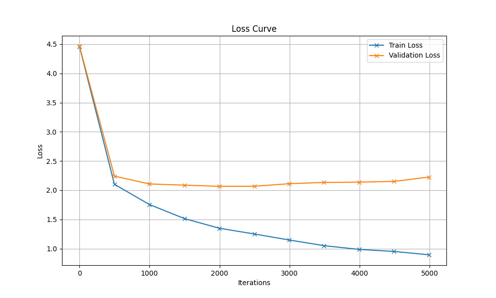

# Generated Song

## Hyperparameters

| Hyperparameter | Value |
|----------------|-------|
| name | original_CPU |
| batch_size | 16 |
| block_size | 32 |
| max_iters | 5000 |
| eval_interval | 500 |
| learning_rate | 0.001 |
| eval_iters | 200 |
| n_embd | 64 |
| n_head | 4 |
| n_layer | 4 |
| dropout | 0.2 |
| device | mps |

## Description

Uses original set of hyperparameter of 3rd notebook for training with a CPU. Means:

- small batch size
- small block size
- bigger learning rate
- small embeddings
- 4 attention heads and 4 hidden layer

## Loss Curve



## Generated Song

```
Sagt, weiß ist der nicht dem Kantern sproben,
gunten Hatrin die Kokosnund,
Die kommt dir gebend anze Klei,

basster kamer nich gein, Stickt fröterne rnicht Fott wen rochens.
3.
Wind ist fleiße
Krass’ sie und ganzw.
3.
Das stimmt zum zu!
Wirzie Und Genustes.
3.
Wester wiiß, was Lusturtu dig nicht Nobi moch odirt hollahiaho!
Geht ist weit den LieOter sie und Schatz
einerzichn, bringt.
2.
Wer wilst frech, weiße im Trmen stegridin unvie gertagernbet.
Im Wasch aus mock schwer;Kind,
unsregef ingt heiligen Kaßen.

Die galt esind dem L ich
allerd will vold fleißige Hanndwerke sie kommmt unde Hate
simmt alles Ja, saßen ist.
2.
Den Tag dier ko
und Mornde kommt bommen das Paser
kommt aus der Chenasstkindlazter Affenden,
schaf!
2.
Leiliereinem seinemante der auftroh zw!
3.
Weihns Weicht en wir Nucht, Nikolausabend schwar voll die Kleider,
lieben in der Liebckschinzen Tag.
Oog wie dich glaute salleus, ist flichelff,
2. wir redchen, schusen beg ist.”
O.
Sankt Männein schen ist.
Kindlein, schwarzen,

