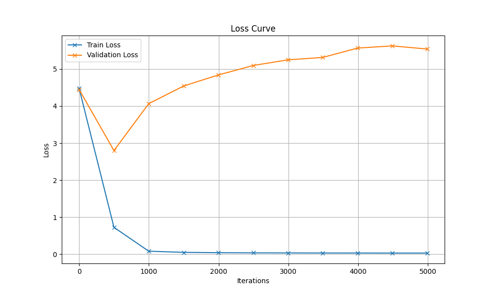

# Generated Song

## Hyperparameters

| Hyperparameter | Value |
|----------------|-------|
| name | original_GPU |
| batch_size | 64 |
| block_size | 256 |
| max_iters | 5000 |
| eval_interval | 500 |
| learning_rate | 0.0003 |
| eval_iters | 200 |
| n_embd | 384 |
| n_head | 6 |
| n_layer | 6 |
| dropout | 0.2 |
| device | mps |

## Description

Uses original set of hyperparameter of 3rd notebook for training with a GPU. Means:

- great batch size
- great block size
- small learning rate
- great embeddings
- 6 attention heads and 6 hidden layer

## Loss Curve



## Generated Song

```
du ich suchen den Rädern ab,
den Rädern,
die gar nicht gerne stille stehn
und sch bei Tag nicht müde drehn,
und sich bei Tag nicht müde drehn,
die Räder.
4.
Oh Wandern, Wandern, meine Lust!
Oh Wandern, Wandern, meine Lust!
Oh Wandern!
Herr Meister und Frau Meisterin,
lasst mich in Frieden weiterziehn,
lasst mich in Frieden weiterziehn
und wandern!

Morgen, Kinder, wirds was geben
morgen werden wir uns freun!
Welch ein Jubel, welch ein Leben
wird in unserm Hause sein!
Einmal werden wir noch wach,
heißa, dann ist Weihnachtstag!
2.
Wie wird dann die Stube glänzen
von der ganzen Lichterzahl!
Schöner als bei frohen Tänzen
ein geputzter Kronensaal.
Wisst ihr noch wie von davor,
hoch oben schwebt jubelnd der Engelein Chor.
4.
O beugt wie die Hirten anbetend die Knie
erhebet die Hände und danket wie sie
stimmt freudig ihr Kinder wer sollt sich nicht freun
stimmt freudig zum Jubel der Engel mit ein.
5.
Was geben wir Kinder was schenken wir dir
du bestes und liebstes der Kinder dafür
nichts will
