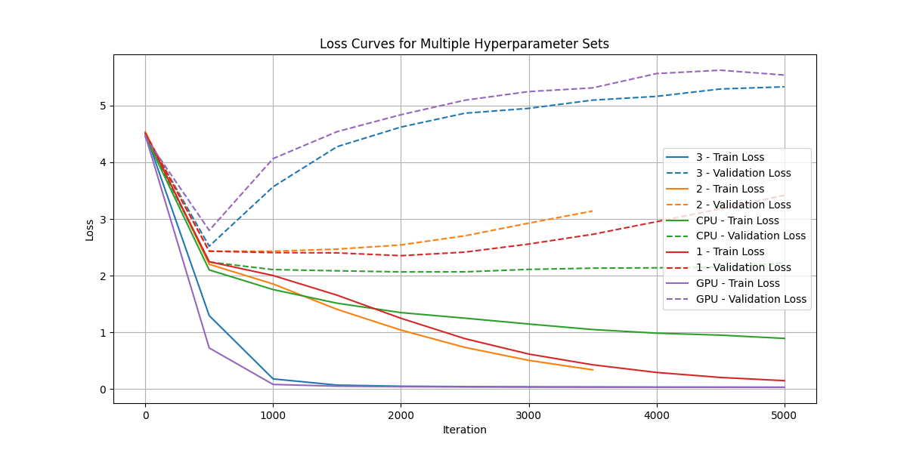

# Summary Plot

# Summary Table

| File Name | Iteration | Train Loss | Validation Loss |
|-|-|-|-|
| losses_modified_hyperparameters_3 | 5000.0 | 0.0340725146234035 | 5.329879283905029 |
| losses_modified_hyperparameters_2 | 3500.0 | 0.3409375846385956 | 3.1399848461151123 |
| losses_original_CPU | 5000.0 | 0.894833505153656 | 2.2247371673583984 |
| losses_modified_hyperparameters_1 | 5000.0 | 0.1492361575365066 | 3.417994737625122 |
| losses_original_GPU | 5000.0 | 0.0322625115513801 | 5.537038803100586 |
